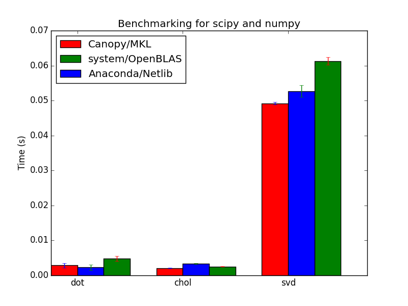
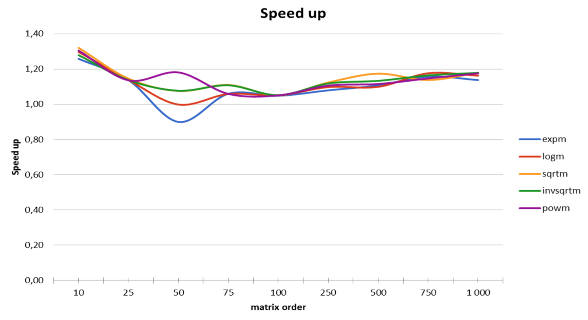
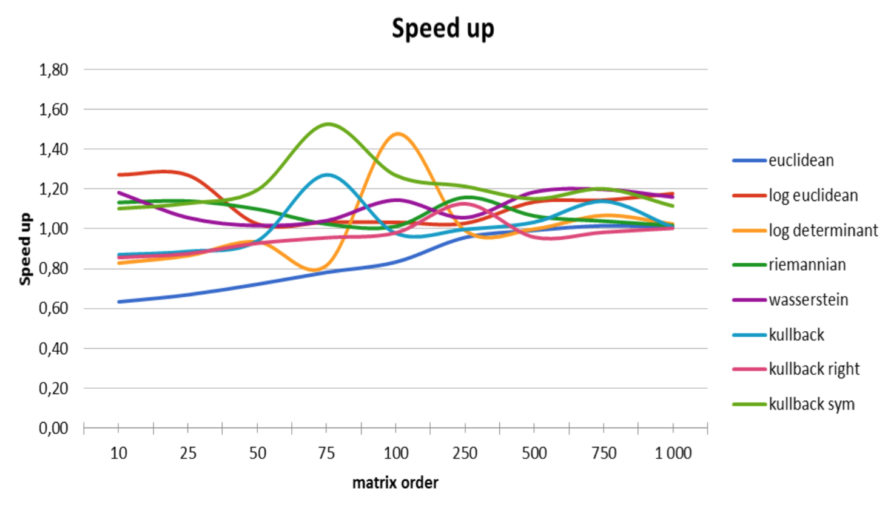
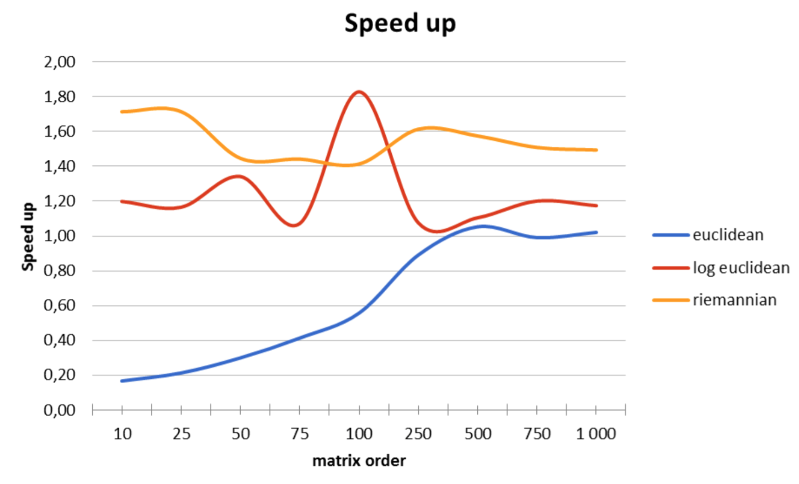
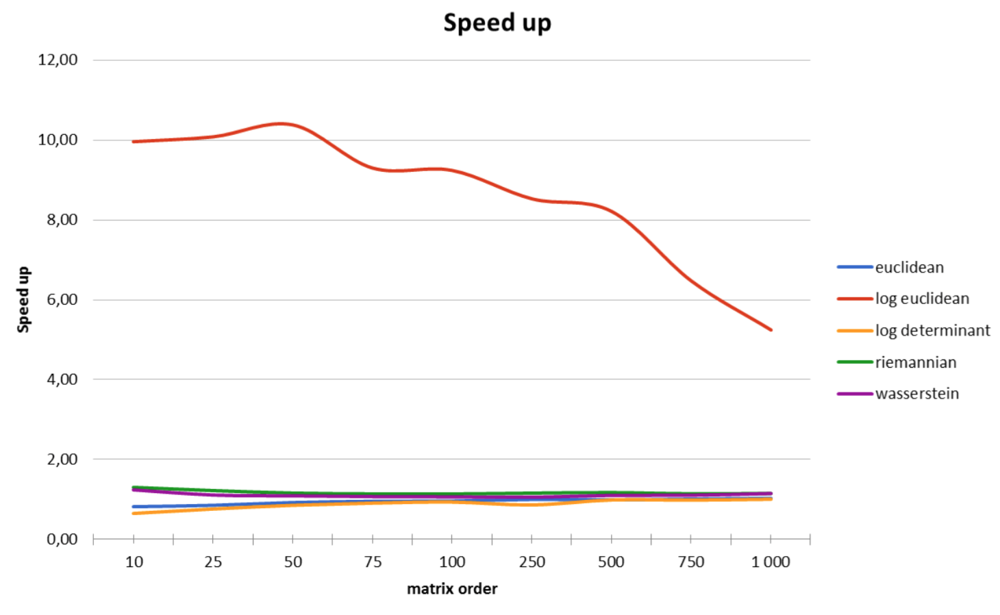
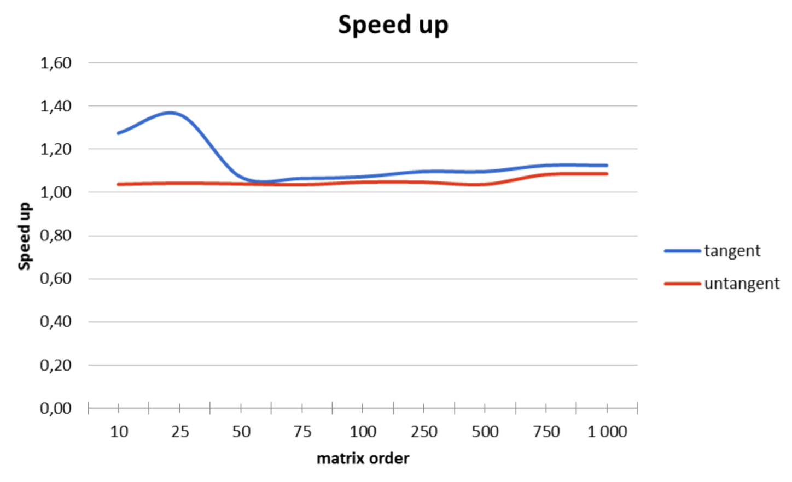

# PyRiemann

Python implementation for EEG-based BCI based on Riemannian geometry, using OpenBLAS

This is a fork from [Alexandre Barachant's pyRiemann toolbox](https://github.com/alexandrebarachant/pyRiemann) and it is a work in progress.

## Benchmarks and selected solutions

We have benchmark two main Python distributions (Canopy, Anaconda) and we have build our own Python toolchain, with numpy compiled against MKL and OpenBLAS.
A canevas script to build the benchmark is available [from this gist](https://gist.github.com/sylvchev/87e42c8fe761a5279213). Some results are plotted below for 500x500 covariance matrices, with the [code available here](https://gist.github.com/sylvchev/97682447313a1d16f642). Nota bene, Anaconda is used in its vanilla version (the free one), it is possible to pay to obtain a version compiled against MKL.

  

Extensive testing shows that OpenBLAS is largely suitable for our computation and that it is much more easier to deploy than MKL. See also [this benchmark](http://stackoverflow.com/questions/7596612/benchmarking-python-vs-c-using-blas-and-numpy).

We have tried to also several alternative solutions:
* Python calling C functions with BLAS calls
* Python linked with matrix classes written in C++, with BLAS calls
* direct call to BLAS functions in Python
* using numpy, either the one embeded in Canopy/Anaconda, or our own build with MKL or OpenBLAS
The most efficient and easy to maintain solution is our own build with numpy build against OpenBLAS. In practice, it just requires to install OpenBLAS on the system and to download/build numpy and scipy as user.

## Difference from pyRiemann toolbox

A specific class is designed for the covariance matrix and the intermediate computation are recorded. For example, when computing Fisher distance (aka AIRM), the eigenvalues needed for the computation are stored for further computation. It increases the memory load but save a lot of computation time when dealing with sucessive computation, such as in computation for Karcher mean. The intermediate variables were carefully selected and evaluated, to avoid inefficient and time-consuming unwanted memory allocation.

Covariance matrices have a dedicated class, which can be handle as a list and as numpy ndarray. This class also store some cached storage, for intermediate computation.

Below are some speed-up test comparison with direct numpy implementation, without cached storage.

  

  

  

  
  
  

## Dependencies

- Numpy
- Scipy
- Scikit-learn
- OpenBLAS
- nose (for continuous integration)

## Contributors:

- Sylvain Chevallier
- Romain Da Rocha
- Rado Andrianjanahary
